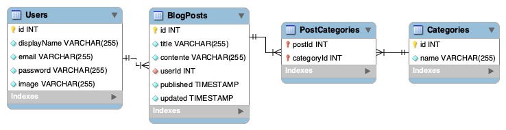

# Projeto Blogs API 👩‍💻 🌐


Projeto realizado no módulo de Back-end durante o curso de Desenvolvimento Web pela [Trybe](https://www.betrybe.com/), a escola que te ensina a programar, a aprender e a trabalhar.


## Descrição

Foi desenvolvido uma `API` e um `banco de dados` para produção de conteúdo para um blog.

Este projeto é uma aplicação em `Node.js` usando o pacote `sequelize` para fazer um CRUD de posts


## 👩‍💻 Tecnologias Utilizadas

- 
-                 
- 
- [Joi](https://joi.dev/api/?v=17.6.0)
- [ExpressJS Async Errors](https://www.npmjs.com/package/express-async-errors)
- [JWT](https://jwt.io/) (Json Web Token)
- [Nodemon](https://www.npmjs.com/package/nodemon)
- [Thunder Client](https://www.thunderclient.com/)
- [DotEnv](https://www.npmjs.com/package/dotenv)
- [Docker](https://www.docker.com/)


## 🛠️ Habilidades Utilizadas

- Criar endpoints seguindo o padrão REST;
- Criar uma API de um CRUD (Create, Read, Update e Delete);
- Criar middlewares e validações;
- Desenvolvimento seguindo a arquitetura MSC;
- Utilizar o `ORM Sequelize` para criar e popular tabelas, consultar, inserir, alterar e deletar dados nas tabelas.


## 🗄️ Fornecido pela [Trybe](https://www.betrybe.com/)

- Arquivo `Dockerfile`, `docker-compose.yml`, `.sequelizerc`, `der.png`, `server.js`, `.eslintrc.json`, `.eslintignore`, `.env.example`, `./src/database/seeders`, `./src/database/config/config.js`.


## 🎲 Banco de dados

**Diagrama de Entidade-Relacionamento**



O Banco possui 4 tabelas criadas com o `ORM Sequelize`:

- Uma tabela chamada `Users` com os atributos:

  |  `id`  | `displayname` | `email` | `password` | `image` |
  |--------|---------------|---------|------------|---------|

- Uma tabela chamada `Categories`, com os atributos:
 
  | `id`| `date` |
  |-----|--------|

- Uma tabela chamada `BlogPosts`, com os atributos:

  |  `id`  | `title` | `content` | `userId` | `published` | `updated` |
  |--------|---------|-----------|----------|-------------|-----------|

  `userId` é uma **chave estrangeira**, referenciando o id da tabela `Users`

  
- Uma tabela chamada `PostCategories`, contendo uma **chave primária composta** utilizando os dois atributos:
  
  | `postId`| `categoryId` |
  |---------|--------------|


## 📝 Scripts para deletar o banco e criá-lo novamente:

#### Para deletar o banco de dados:
```
npm run drop
```
#### Para criar e gerar as tabelas:
```
npm run prestart
```
#### Para popular as tabelas:
```
npm run seed
```


## ⌨️ Variáveis de Ambiente

Para rodar esse projeto, você vai precisar adicionar as seguintes variáveis de ambiente no seu `.env`

É importante configurar as variáveis: `MYSQL_HOST`, `MYSQL_PORT`, `MYSQL_USER`, `MYSQL_PASSWORD`

```
#### SERVER VARS
NODE_ENV=development
API_PORT=3000

#### DATABASE VARS
MYSQL_HOST=localhost
MYSQL_PORT=3306
MYSQL_DB_NAME=blogs-api
MYSQL_USER=root
MYSQL_PASSWORD=password

#### SECRECT VARS
JWT_SECRET=suaSenhaSecreta
```
Caso opte por uma configuração padrão basta renomear o arquivo `.env.example` para `.env`


## ⚙️ Instalando Dependências

Para rodar esta aplicação é necessário ter o **Docker** 🐳 e **Docker Compose** instalados no seu computador.

O **Docker Compose** precisa estar na versão **1.29** ou superior.


### 1. Clone o repositório
```
git clone git@github.com:tiemifaustino/blogs-api.git
```

  * Entre na pasta do repositório que você acabou de clonar:
```
cd blogs-api
```


### 2. Rode os serviços `node` e `db` com o comando:
```
docker-compose up -d --build
```
**Esses serviços irão inicializar um container chamado `blogs_api` e outro chamado `blogs_api_db`**


### 3. Use o comando abaixo para ter acesso ao terminal interativo do container `blogs_api` criado pelo compose, que está rodando em segundo plano.
```
docker exec -it blogs_api bash
```


### 4. Dentro do terminal do container `blogs_api` instale as dependências:
```
npm install
```


### 5. Dentro do terminal do container `blogs_api` execute a aplicação:
```
npm start
```

### 6. Caso utilize a extensão [Thunder Client](https://www.thunderclient.com/) do VS Code:
* os endpoints estão salvos no diretório `thunder-tests`
